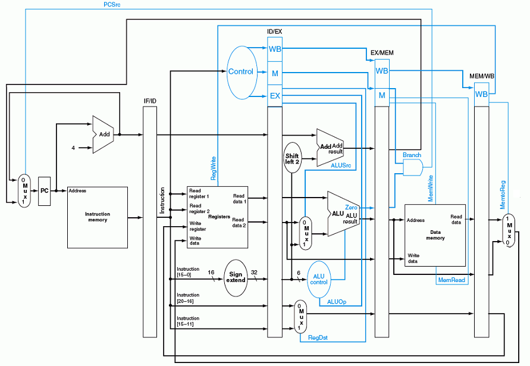

# MIPS Simulator
This is the curriculum design for the Computer Processor and System (MR329 in SJTU). The main target of this project is using _Verilog_ to realize the basic function of MIPS, which includes the common instruction set, pipeline design, and cache simulation. This work finnally got full marks in project acceptance. 

## Introduction
### Single period
The next picture just illustrates the whole architecture of the single period MIPS, with six basic unit of function: Control, AluCtr, ALU, regFile, Memory, and Sign Extend.

### Piple Design
The piple design differs with the single period by adding four stages of registers which divides the job in single period into five similiar part, including Instruction Fetch (IF), Instrution Decode (ID), Excution (EX), Memory (M), Write Back (WB). The main trick is how to deal with the data and control hazard.

### Cache design
The Cache  is realized by adding registers before the Memory and set different time access time. The control logic is constructed with a FSM as is shown in the next figure.

<!-- 

<!--  

-->

## Project Usage Instruction
The whole project is simulated to be right in the ModuleSim and is divided into two parts:

/Basic section: Single period and pipeline design without Cache

/Advanced secton: Single period and pipeline desing with cache

/Testing instruction: Some test cases to verify the design. Notice that, in order to use these testing cases, you need to firstly transmit them into 0/1 instruction code by using the assembler in this file.

## Acknowledgement:
The work is accomplished together by Qingyang Yi, Xinshi Zang, and Zhemin Lu. My contribution mainly includes the single period and cache design and part of the pipelines design.

<!-- comment -->

